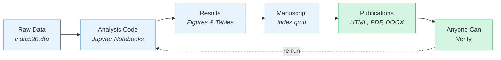
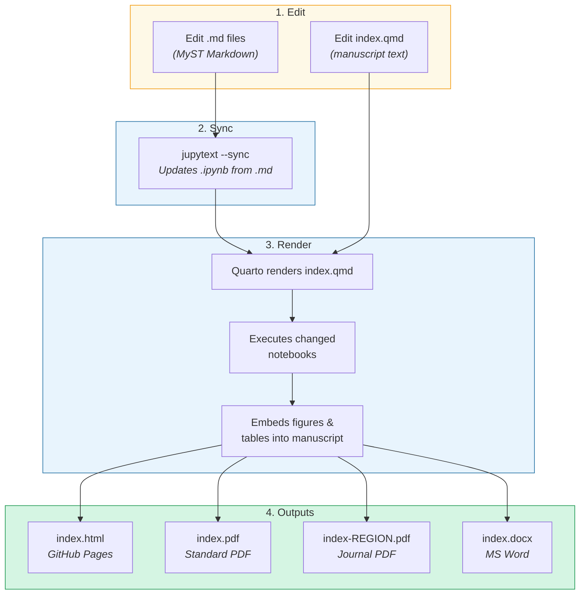
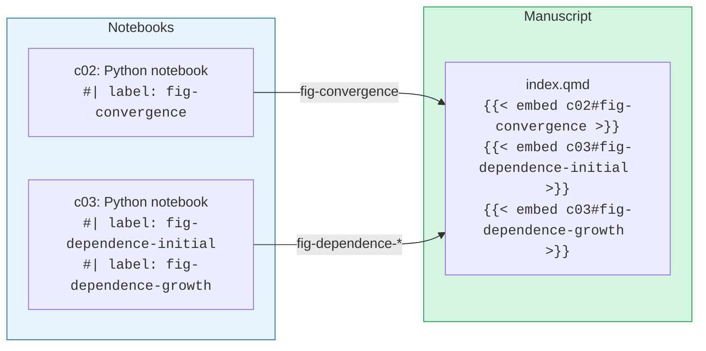

# Spatial Convergence of Nighttime Lights in India (1996--2010)

**A reproducible research project** analyzing regional economic convergence across 520 Indian districts using satellite nighttime light data and spatial econometric methods.

| Resource | Link |
| -------- | ---- |
| Interactive manuscript | [quarcs-lab.github.io/project2025s-py](https://quarcs-lab.github.io/project2025s-py/) |
| Standard PDF | [`index.pdf`](index.pdf) |
| REGION journal PDF | [`index-REGION.pdf`](index-REGION.pdf) |
| Repository | [github.com/quarcs-lab/project2025s-py](https://github.com/quarcs-lab/project2025s-py) |

---

## Project status

All computational notebooks are now **Python**: `c02` (regional convergence) was translated from R and `c04` (spillover modeling) from Stata, while `c01`, `c03`, `c05`, and `c06` were already Python. The Google Earth Engine app remains JavaScript.

- **Spatial Durbin impacts** in `c04` are reported with the **full (LeSage–Pace)** method, which builds the direct, indirect, and total effects from the exact spatial multiplier matrix $(I-\rho W)^{-1}$. The notebook also includes a **simple / full / power** robustness comparison for the preferred specification.
- **Reproducible pipeline:** Python dependencies are managed with [uv](https://docs.astral.sh/uv/); running `bash scripts/clean-render.sh` regenerates every output (interactive HTML, standard PDF, REGION journal PDF, and DOCX) from `index.qmd` and the notebooks.

---

## Why Reproducible Research?

Scientific results should be **verifiable**. When a reader encounters a figure or a statistical estimate, they should be able to trace it back to the raw data, run the same code, and arrive at the same result. This is the idea behind **reproducible research**.

In practice, reproducibility means:

1. **Data** is openly available (or clearly documented)
2. **Code** that produces every result is included alongside the paper
3. **Environment** (software versions, dependencies) is recorded so the code runs the same way everywhere
4. **Outputs** (figures, tables, manuscript) are generated automatically from code --- not copy-pasted manually

This project implements all four principles. The diagram below shows how they connect:



> **Key insight:** The manuscript, figures, and tables are never created by hand. They are always *generated* from code and data. If the data changes, one command regenerates everything.

---

## About This Project

Nighttime satellite images reveal how brightly lit a region is after dark. Brighter lights generally mean more economic activity --- more factories, shops, and infrastructure. Researchers use this **nighttime light (NTL)** data as a proxy for economic output, especially in developing countries where GDP statistics at the district level may be unreliable.

This project asks three questions about India's 520 administrative districts between 1996 and 2010:

1. **Convergence:** Do poorer districts (dimmer lights) grow faster than richer ones (brighter lights)?
2. **Spatial dependence:** Do neighboring districts have similar luminosity patterns?
3. **Spillovers:** Does a neighbor's brightness help or hinder local growth?

**Key findings:**

- Districts exhibit **beta-convergence** --- initially dimmer districts grew faster
- Strong **spatial clustering** exists (Moran's I = 0.73 for initial levels, 0.60 for growth)
- **Spatial spillovers accelerate convergence** --- in the preferred model the implied annual speed rises from ~3% (OLS) to ~5% (spatial Durbin); the SDM total effect is ~48% larger than OLS (up to 64% in Model 3)

---

## The Tool Stack

This project combines several open-source tools. Each one plays a specific role in the reproducibility pipeline:

| Tool | What it does | Why we use it |
| ---- | ------------ | ------------- |
| [**Quarto**](https://quarto.org) | Renders the manuscript from a single source file into HTML, PDF, and DOCX | Write once, publish everywhere --- one command generates all output formats |
| [**uv**](https://docs.astral.sh/uv/) | Manages Python packages and virtual environments | Deterministic builds --- `uv.lock` ensures everyone installs identical package versions |
| [**Jupytext**](https://jupytext.readthedocs.io/) | Pairs notebooks (`.ipynb`) with readable Markdown files (`.md`) | Edit code in clean text files instead of JSON blobs; better for version control |
| [**Jupyter**](https://jupyter.org) | Runs computational notebooks interactively | Mix code, output, and narrative in a single document |
| [**Python**](https://www.python.org) | All computation: convergence regression (statsmodels), spatial econometrics (PySAL / spreg), and geospatial analysis & visualization (GeoPandas) | A single open-source language for the entire pipeline |
| [**Git / GitHub**](https://github.com) | Version control and hosting | Track every change; GitHub Pages hosts the live manuscript |

---

## Quick Start

### Prerequisites

- [uv](https://docs.astral.sh/uv/getting-started/installation/) (Python package manager)
- [Quarto](https://quarto.org/docs/get-started/) (manuscript rendering)

### 4 Steps to Reproduce

```bash
# 1. Clone the repository
git clone https://github.com/quarcs-lab/project2025s-py.git
cd project2025s-py

# 2. Install Python dependencies (creates .venv/ automatically)
uv sync

# 3. Launch Jupyter to explore the notebooks
uv run jupyter notebook

# 4. Build the entire manuscript (HTML + PDF + DOCX)
bash scripts/clean-render.sh
```

That's it. Step 2 reads `pyproject.toml` and `uv.lock` to install the exact same package versions used to produce the published results. Step 4 runs all notebooks and generates every output format.

### Editor setup (optional)

VS Code settings are **not tracked** because they contain machine-specific paths. A template is provided instead:

```bash
cp .vscode/settings.json.template .vscode/settings.json
```

This configures the Python interpreter and Jupytext extension to use the project's virtual environment. The template uses `${workspaceFolder}`, which VS Code resolves to your local project path automatically.

---

## Project Structure

```text
project2025s-py/
│
├── index.qmd                  # Manuscript source (the ONE file you write in)
│
├── notebooks/                 # Computational notebooks
│   ├── c01_view_from_space.ipynb      # N1: Interactive GEE visualization
│   ├── c01_view_from_space.md         #     ↔ MyST Markdown (editable)
│   ├── c02_regional_convergence_sc.ipynb  # N2: Beta-convergence (Python)
│   ├── c02_regional_convergence_sc.md     #     ↔ MyST Markdown (editable)
│   ├── c03_spatial_dependence_lisa.ipynb   # N3: LISA cluster maps (Python)
│   ├── c03_spatial_dependence_lisa.md      #     ↔ MyST Markdown (editable)
│   ├── c04_spillover_modeling_6nn.ipynb    # N4: Spatial Durbin Models (Python)
│   └── c04_spillover_modeling_6nn.md       #     ↔ MyST Markdown (editable)
│
├── data/                      # Data (raw inputs + generated weights matrix)
│   ├── india520.dta           #   Main dataset: 520 districts, 1996-2010
│   ├── india520.geojson       #   District boundary polygons
│   ├── W_matrix.csv           #   Spatial weights matrix (6NN, row-normalized)
│   ├── W_matrix.dta           #   Spatial weights matrix (Stata format)
│   └── maps/                  #   GeoPackage files for mapping
│
├── scripts/
│   └── clean-render.sh        # Master build script (one command does everything)
│
├── images/                    # Manuscript images (luminosity maps + LISA cluster maps)
├── tables/                    # Markdown table definitions
│
├── _quarto.yml                # Quarto project configuration
├── _extensions/               # REGION journal LaTeX template
├── docs/                      # Documentation (troubleshooting guides)
├── references.bib             # Bibliography
│
├── pyproject.toml             # Python dependencies (source of truth)
├── uv.lock                    # Locked dependency versions (reproducibility)
├── .python-version            # Python version pin (3.10)
├── requirements.txt           # Legacy fallback for pip / Google Colab
├── jupytext.toml              # Jupytext pairing convention
│
├── index.html                 # Output: interactive web manuscript
├── index.pdf                  # Output: standard PDF (Letter)
├── index-REGION.pdf           # Output: REGION journal PDF (A4)
├── index.docx                 # Output: Microsoft Word
│
├── .vscode/
│   └── settings.json.template # VS Code settings template (copy to settings.json)
│
├── legacy/                    # Immutable archive + frozen submission bundles
│   ├── (original project snapshot)
│   └── submission-YYYYMMDD/   # Self-contained journal submission bundles
├── log/                       # Session progress logs
├── CLAUDE.md                  # AI assistant guidelines
└── README.md                  # This file
```

**Design principle:** Source files (`.qmd`, `.ipynb`, `.md`, data) live in the repository. Output files (`.html`, `.pdf`, `.docx`) are *generated* from source and committed for transparency --- readers can access them directly on GitHub without running any code.

---

## The Write-Once-Publish-Everywhere Workflow

The entire project is built from a **single command**:

```bash
bash scripts/clean-render.sh
```

This script clears all caches, runs every notebook, and generates four output formats from the manuscript source (`index.qmd`). Here is what happens under the hood:



### What `clean-render.sh` does (step by step)

| Step | Command | Purpose |
| ---- | ------- | ------- |
| 1 | `rm -rf _freeze/ .quarto/embed/ ...` | Clear all caches for a clean build |
| 2 | `quarto render index.qmd` | Full render: HTML + notebook previews + all formats |
| 3 | `quarto render --to region-ersa/REGION-pdf` | Re-render REGION PDF with 4 LaTeX passes (fixes bibliography) |
| 4 | `quarto render --to pdf` | Re-render standard PDF (restores LaTeX source) |

> **Why 3 render passes instead of 1?** When Quarto renders all formats at once, the REGION journal PDF only gets 2 LaTeX passes instead of the 4 required for its `natbib`/`region.bst` bibliography processing. Rendering each PDF format separately avoids this issue.

---

## Computational Notebooks

The analysis is organized into four Jupyter notebooks, all written in Python:

| Notebook | Title | Language | Embedded in manuscript |
| -------- | ----- | -------- | ---------------------- |
| `c01_view_from_space` | View from outer space | Python | No (supplementary) |
| `c02_regional_convergence_sc` | Regional convergence | Python | Yes --- `fig-convergence` |
| `c03_spatial_dependence_lisa` | Spatial dependence (LISA) | Python | Yes --- `fig-dependence-initial`, `fig-dependence-growth` |
| `c04_spillover_modeling_6nn` | Spillover modeling | Python | Yes --- `tbl-models` |

### How notebooks feed into the manuscript

Quarto's `` shortcode pulls specific labeled figures from notebooks directly into the manuscript:



This means you never copy-paste figures into the paper. When the data or analysis changes, the figures update automatically on the next render.

### Jupytext: Edit MyST Markdown instead of raw notebooks

Jupyter notebooks (`.ipynb`) are JSON files --- functional but hard to read and impossible to diff meaningfully in Git. [Jupytext](https://jupytext.readthedocs.io/) solves this by pairing each notebook with a **MyST Markdown** (`.md`) file.

| Notebook (`.ipynb`) | MyST Markdown (`.md`) | Kernel |
| -------------------- | --------------------- | ------ |
| `c01_view_from_space.ipynb` | `c01_view_from_space.md` | Python |
| `c02_regional_convergence_sc.ipynb` | `c02_regional_convergence_sc.md` | Python |
| `c03_spatial_dependence_lisa.ipynb` | `c03_spatial_dependence_lisa.md` | Python |
| `c04_spillover_modeling_6nn.ipynb` | `c04_spillover_modeling_6nn.md` | Python |

**What does a MyST Markdown file look like?**

````markdown
---
jupytext:
  formats: ipynb,md:myst
kernelspec:
  display_name: Project 2025s (Python 3.10)
  name: project2025s
---

# Spatial Dependence Analysis

This notebook examines spatial patterns of nighttime lights
across 520 Indian districts using Local Moran's I...

## Setup

```{code-cell} ipython3
import numpy as np
import geopandas as gpd
from esda.moran import Moran_Local
```

## Load Data

```{code-cell} ipython3
gdf = gpd.read_file("../data/india520.geojson")
```
````

Notice how the Markdown is just *regular Markdown* --- not commented-out code. Code cells use clean ```` ```{code-cell} ```` fenced blocks. The file reads like a document, not a program.

**The sync workflow:**

```bash
# After editing a .md file, sync it to the .ipynb:
uv run jupytext --sync notebooks/<file>

# After editing a .ipynb in Jupyter, the .md updates automatically
# (if the Jupytext server extension is enabled)
```

---

## How to Edit and Rebuild

### Editing the manuscript text

1. Open [`index.qmd`](index.qmd) in any text editor
2. Make your changes (introduction, methods, conclusions, citations...)
3. Render: `quarto render index.qmd`

For text-only changes, you don't need `clean-render.sh` --- a plain `quarto render` is faster.

### Editing a notebook

1. Open the `.md` file in your editor (e.g., `notebooks/c03_spatial_dependence_lisa.md`)
2. Edit the code or narrative
3. Sync to the notebook: `uv run jupytext --sync notebooks/c03_spatial_dependence_lisa.md`
4. Rebuild the manuscript: `bash scripts/clean-render.sh`

The build script clears Quarto's embed caches, re-executes changed notebooks, and regenerates all outputs.

### Adding a new notebook

1. Create a `.ipynb` file in `notebooks/`
2. Pair it with Jupytext: `uv run jupytext --set-formats "ipynb,md:myst" --sync notebooks/my_notebook.ipynb`
3. Add labeled outputs in the notebook (e.g., `#| label: fig-myplot`)
4. Register it in [`_quarto.yml`](_quarto.yml):

   ```yaml
   manuscript:
     notebooks:
       - notebook: notebooks/my_notebook.ipynb
         title: "N5: My new analysis"
   ```

5. Embed its outputs in `index.qmd`:

   ```markdown
   
   ```

6. Build: `bash scripts/clean-render.sh`

---

## Data

**Main dataset:** [`data/india520.dta`](data/india520.dta) (Stata format, 1.2 MB)

| Property | Value |
| -------- | ----- |
| Observations | 520 Indian administrative districts |
| Time period | 1996--2010 |
| Source | DMSP-OLS radiance-calibrated nighttime lights via Google Earth Engine |
| Spatial weights | 6 nearest neighbors (6NN) matrix, row-normalized (520 x 520) |

**Key variables:**

| Variable | Description |
| -------- | ----------- |
| `light_growth96_10rcr_cap` | Luminosity growth rate per capita (dependent variable) |
| `log_light96_10rcr_cap` | Log initial luminosity per capita |
| `SL_light_growth96_10rcr_cap` | Spatial lag of growth |
| `SL_log_light96_10rcr_cap` | Spatial lag of initial luminosity |
| Geographic controls | Terrain ruggedness, rainfall, temperature |
| Demographic controls | Literacy rate, education, electrification |
| Economic controls | Population density, road infrastructure |

---

## Output Formats

One source file produces four output formats, each optimized for a different purpose:

| Output | Format | Purpose |
| ------ | ------ | ------- |
| [`index.html`](https://quarcs-lab.github.io/project2025s-py/) | Interactive HTML | Web reading, embedded notebooks, GitHub Pages |
| [`index.pdf`](index.pdf) | Standard PDF (Letter) | General sharing, KOMA-Script, numeric citations |
| [`index-REGION.pdf`](index-REGION.pdf) | REGION Journal PDF (A4) | Journal submission, author-year citations, line numbers |
| [`index.docx`](index.docx) | Microsoft Word | Collaboration and commenting |

### Two PDF formats explained

The project generates **two distinct PDFs** because academic publishing has different needs:

| Property | Standard PDF | REGION Journal PDF |
| -------- | ------------ | ------------------ |
| Page size | Letter (8.5" x 11") | A4 (8.27" x 11.69") |
| Document class | `scrartcl` (KOMA-Script) | `article` (REGION template) |
| Citations | Numeric: [1], [2] | Author-year: (Chanda and Kabiraj 2020) |
| Line numbers | No | Yes (review mode) |
| Branding | None | ERSA logo, journal ISSN |
| Use case | General distribution | Peer review submission |

---

## Journal Submission Bundles

When the manuscript is ready to be sent to a journal editor, the project produces a **frozen, self-contained submission bundle** at `legacy/submission-YYYYMMDD/`. Each bundle is a dated snapshot that can be delivered to the editor as a single directory without any external dependencies.

**What's in a bundle:**

```text
legacy/submission-YYYYMMDD/
├── README.md                       # Bundle manifest (blind)
├── CoverLetter.md                  # Editor correspondence (non-blind)
├── manuscript-REGION.pdf           # Primary submission PDF (blind)
├── manuscript.docx                 # Word version (blind)
├── manuscript-standalone.html      # Single-file HTML with embedded assets (blind)
└── latex-manuscript/               # Self-contained LaTeX source tree (blind)
    ├── manuscript.tex              #   Rewritten from index-REGION.tex
    ├── references.bib
    ├── regart.cls, region.sty, region.bst
    ├── titlepage_*.pdf, ERSA_logo.png, wutext.pdf, fwf.pdf
    └── figures/                    #   All ten manuscript figures
```

**Blind vs non-blind:** every file in the bundle is anonymized for reviewer distribution *except* `CoverLetter.md`, which is addressed to the editor and contains corresponding-author contact info. The editor distributes only the manuscript files to reviewers.

**How to create a bundle:** invoke the `/prepare-region-submission` skill. It runs nine phases end to end: preflight checks, author-config load, anonymization audit of `index.qmd`, full manuscript render, standalone HTML generation, bundle assembly with figure-path flattening and case-sensitive filename fixes, cover letter and README generation from templates, and a three-gate verification (standalone LaTeX must compile with `lualatex` + `bibtex`, a recursive blindness grep must return zero matches outside `CoverLetter.md`, and the PDF metadata must not contain author names). The skill stops at verification and leaves the git commit to the user.

**Author metadata** used by the cover letter lives in [`.claude/author-config.yml`](.claude/author-config.yml). The skill reads it at invocation time and prompts interactively for any missing fields.

---

## Configuration

### Python environment

| File | Purpose |
| ---- | ------- |
| [`pyproject.toml`](pyproject.toml) | Python dependencies --- **source of truth** |
| [`uv.lock`](uv.lock) | Locked versions for deterministic builds |
| [`.python-version`](.python-version) | Pins Python 3.10 |
| [`requirements.txt`](requirements.txt) | Legacy fallback for pip / Google Colab |

**Common commands:**

```bash
uv sync                    # Create .venv/ and install all dependencies
uv add <package>           # Add a new dependency
uv run python script.py    # Run a script in the project's venv
uv run jupyter notebook    # Launch Jupyter in the project's venv
```

### Quarto configuration

[`_quarto.yml`](_quarto.yml) defines:

- Project type: `manuscript`
- Registered notebooks and their display titles
- All four output formats and their settings
- `freeze: auto` --- only re-execute notebooks whose source has changed

---

## Interactive Tools

**Google Earth Engine web app** --- explore India's nighttime lights interactively:

- App: <https://carlos-mendez.projects.earthengine.app/view/rc-dmsp-ntl>
- Source code: <https://code.earthengine.google.com/87ac51fc81a194c7a1dfa299f3251a95>

---

## License

This work is licensed under a [Creative Commons Attribution 4.0 International License (CC BY 4.0)](https://creativecommons.org/licenses/by/4.0/).

[](https://creativecommons.org/licenses/by/4.0/)

You are free to:

- **Share** --- copy and redistribute the material in any medium or format
- **Adapt** --- remix, transform, and build upon the material for any purpose, even commercially

Under the following terms:

- **Attribution** --- You must give appropriate credit, provide a link to the license, and indicate if changes were made.

---

## Citation

```bibtex
@article{mendez2026spatial,
  author  = {Mendez, Carlos and Kabiraj, Sujana and Li, Jiaqi},
  title   = {Spatial Convergence of Nighttime Lights in India (1996--2010)},
  year    = {2026},
  url     = {https://github.com/quarcs-lab/project2025s-py}
}
```

---

## Authors

- **Carlos Mendez** (Corresponding) --- Nagoya University --- <carlosmendez777@gmail.com>
- **Sujana Kabiraj** --- Shiv Nadar University
- **Jiaqi Li** --- Nagoya University

## Acknowledgments

- DMSP-OLS Nighttime Lights data from [Google Earth Engine](https://earthengine.google.com)
- Indian district boundary data from [geoBoundaries](https://www.geoboundaries.org)
- Spatial econometric methods from [PySAL](https://pysal.org)
- Quarto publishing system by [Posit](https://quarto.org)

---

**Last updated:** April 10, 2026
